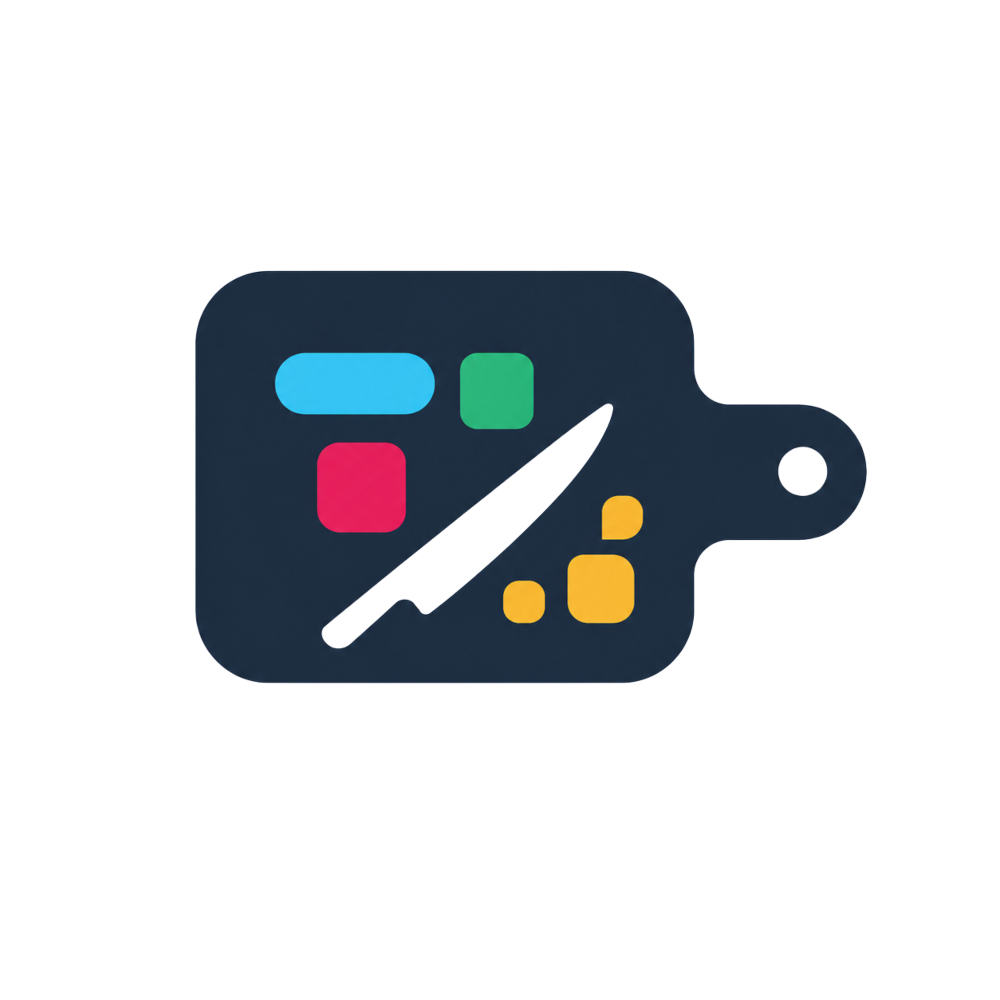
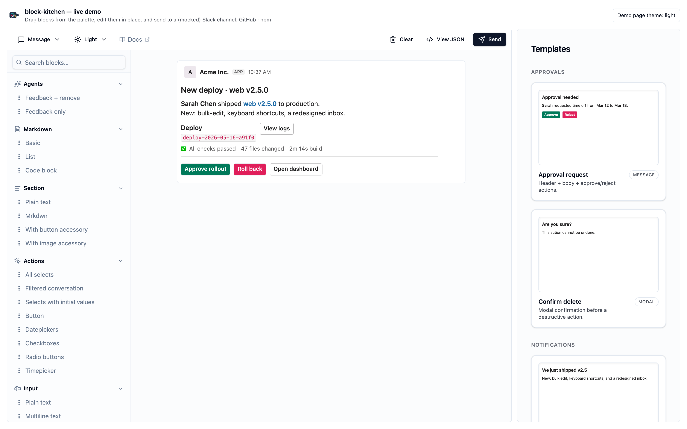

<p align="center">
  
</p>

# block-kitchen

[](https://github.com/TightknitAI/block-kitchen/actions/workflows/ci.yml)
[](https://www.npmjs.com/package/@tightknitai/block-kitchen)
[](https://bundlephobia.com/package/@tightknitai/block-kitchen)
[](https://opensource.org/licenses/MIT)
[](https://block-kitchen.tightknit.dev)

A drag-and-drop, no-code-friendly visual builder for Slack Block Kit messages, packaged as an **integration-agnostic React component**.

Inspired by [Slack's Block Kit Builder](https://app.slack.com/block-kit-builder), reimagined as an embeddable React component you can drop into your own app.

**[Try the live demo →](https://block-kitchen.tightknit.dev)** (mocked Slack — drag, drop, edit, preview)

<p align="center">
  
</p>

The package owns the entire builder UX — palette, sortable preview surface, per-block popover editors, send dialog. It knows nothing about how channels are listed, who the user is, or how messages are sent. The consumer wires those concerns through callback props. A working end-to-end app is shown in [block-kitchen-template](https://github.com/TightknitAI/block-kitchen-template).

## Install

```bash
pnpm add @tightknitai/block-kitchen
```

Modern package managers (pnpm 8+, npm 7+, yarn berry) auto-install peer
dependencies — no extra command needed. The peer set is deliberately
narrow: only the dependencies a typical consumer is likely to *already*
have, where deduplication gives them a real win:

- `react` `^18 || ^19`, `react-dom` `^18 || ^19`
- `@radix-ui/react-{dialog,label,popover,radio-group,slot,tooltip}` —
  the dialog/popover/tooltip/sheet primitives the builder uses. If
  you already use shadcn/ui you already have these, and peer
  deduplication avoids two Radix copies (which would split React
  context — a `<TooltipProvider>` from your copy can't reach a
  `<Tooltip>` from ours).
- `lucide-react` — every icon in the toolbar, palette, and editors.
  Universal in modern React UI stacks; peer keeps a single copy.

Everything else (`@dnd-kit/*`, `@tiptap/*`, `slack-blocks-to-jsx`,
`@tightknitai/slack-block-kit-validator`) is a regular dependency.
Most consumers don't already have these, so there's no dedupe benefit
to forcing them into a peer position — and you don't have to think
about their versions.

If your package manager doesn't auto-install peers:

```bash
pnpm add @tightknitai/block-kitchen \
  react react-dom \
  @radix-ui/react-dialog @radix-ui/react-label \
  @radix-ui/react-popover @radix-ui/react-radio-group \
  @radix-ui/react-slot @radix-ui/react-tooltip \
  lucide-react
```

## Usage

> **Import the stylesheet once, at app root.** The builder mounts
> dialogs, popovers, tooltips, and the mobile palette sheet via React
> portals, which render to `document.body` — outside the route tree.
> If you import `styles.css` inside a single route module, those
> portal contents will be unstyled on every other route that doesn't
> import it. Put the import in your root layout (Next.js `app/layout.tsx`,
> Remix `app/root.tsx`, Vite `src/main.tsx`, etc.).

```tsx
import { BlockKitchen } from "@tightknitai/block-kitchen";
import "@tightknitai/block-kitchen/styles.css";

export function MyBuilderPage() {
  return (
    <BlockKitchen
      workspaceName="Acme Inc."
      loadChannels={async () => {
        const res = await fetch("/api/slack/channels");
        return res.json();
      }}
      loadSendAsUserStatus={async () => {
        const res = await fetch("/api/slack/me/can-send-as-user");
        return res.json();
      }}
      onSend={async ({ channelId, blocks, sendAsUser }) => {
        const res = await fetch("/api/slack/messages/send", {
          method: "POST",
          body: JSON.stringify({ channelId, blocks, sendAsUser }),
        });
        return res.json();
      }}
    />
  );
}
```

## Props

| Prop | Type | Required | Description |
|---|---|---|---|
| `workspaceName` | `string` | no | Shown in the preview chrome to mimic a real Slack message header. |
| `initialBlocks` | `SupportedBlock[]` | no | Starting draft. If omitted, the builder starts empty. |
| `onChange` | `(blocks: SupportedBlock[]) => void` | no | Fires on every state change. Use this to persist the draft (URL, localStorage, etc). |
| `loadChannels` | `() => Promise<{ id: string; name: string }[]>` | yes | Returns channels available to send to. The package never makes Slack API calls itself. |
| `loadSendAsUserStatus` | `() => Promise<{ canSendAsUser: boolean; oauthUrl?: string }>` | yes | Whether the current user has a Slack user-token and can post as themselves. If `canSendAsUser` is false, `oauthUrl` is shown as a "Sign in with Slack" link. |
| `onSend` | `(payload) => Promise<{ ok: boolean; error?: string }>` | yes | Called when the user submits the send dialog. Payload is `{ channelId, blocks, sendAsUser }`. |
| `previewHooks` | `PreviewHooks` | no | Hooks forwarded to `slack-blocks-to-jsx`'s `<Message>` for resolving user / channel / emoji directives. |
| `palette` | `PaletteSection[]` | no | The left-hand palette of draggable variants. Defaults to `defaultPalette`. Spread it to filter, reorder, or add your own pre-configured variants — see [Customizing the palette](#customizing-the-palette). |
| `disabledBlockTypes` | `SupportedBlockType[]` | no | Block types to hide from the palette without rebuilding it. Filters at the variant level — a section keeps any variants whose block types aren't disabled; sections that end up empty are dropped. Convenient when you want the default palette minus a few types (e.g. `['image', 'table']` for a text-only builder). |
| `defaultOpenSections` | `boolean \| string[]` | no | Which palette section headers are expanded on first paint. `true` (default) opens all sections; `false` collapses all (Slack-style); an array opens only sections whose `name` is in the list (e.g. `['Section', 'Actions']`). The palette also has a built-in search input that expands matching sections on demand. |
| `showPaletteSearch` | `boolean` | no | Whether the palette renders the quick-search input above the section list. Defaults to `true`. Set `false` for compact palettes (e.g. when you've passed a small custom `palette`) where scanning by eye is faster than typing. |
| `paletteSearchPlaceholder` | `string` | no | Placeholder text for the palette search input. Defaults to `'Search blocks…'`. Useful for localization. |
| `allowedSurfaces` | `PreviewSurface[]` | no | Allowlist of preview surfaces (`'message'`, `'modal'`, `'app_home'`). Defaults to `['message']` — surface dropdown is hidden when only one surface is allowed. The first entry is the initial selection. |
| `showThemeControl` | `boolean` | no | Defaults to `true`. When `false`, the theme is locked to `'light'`. |
| `defaultPreviewTheme` | `'light' \| 'dark'` | no | Pass the host app's current theme so the preview opens matched to the consuming app's appearance. |
| `theme` | `BrandTheme \| BrandPreset` | no | Branding tokens applied to the builder chrome (toolbar, palette, popovers, dialogs). Accepts a `Partial<BrandTokens>` map and optional `light`/`dark` overrides. See [Styling](#styling) below. |

## Customizing the palette

The default palette ships with curated presets for every supported block type. To narrow what's available, or add your own pre-configured variants (e.g. a "Help footer" section), pass a `palette` array. Define it at module scope (or wrap in `useMemo`) so it stays referentially stable across renders.

```tsx
import {
  BlockKitchen,
  defaultPalette,
  type PaletteSection,
} from "@tightknitai/block-kitchen";

const PALETTE: readonly PaletteSection[] = [
  ...defaultPalette.filter((s) => s.blockType !== "input"),
  {
    name: "Company presets",
    blockType: "section",
    variants: [
      {
        id: "help_footer",
        label: "help footer",
        factory: () => ({
          type: "section",
          text: { type: "mrkdwn", text: "Need help? Reach out in <#C0HELP>." },
        }),
      },
    ],
  },
];

<BlockKitchen palette={PALETTE} {...rest} />;
```

Variant `id`s must be unique across the array — the drag-drop lookup keys by id.

## Boundary

The package is deliberately decoupled from any Slack SDK or backend. It does not import HTTP clients, OAuth libraries, or workspace-state systems. Everything I/O-shaped is brokered through props.

Helpers also exported:

```ts
import {
  toSlackBlocks,           // strips builder-only fields (e.g. header `level`) before sending
  encodeBlocksToString,    // base64url-encode a blocks array (for URL state)
  decodeBlocksFromString,
  defaultPalette,          // the built-in palette — spread to customize
} from "@tightknitai/block-kitchen";

import type {
  SupportedBlock,
  SupportedBlockType,
  BlockKitchenProps,
  PaletteSection,
  PaletteVariant,
  SendPayload,
  SendResult,
  ChannelOption,
  SendAsUserStatus,
  PreviewHooks,
} from "@tightknitai/block-kitchen";
```

## Backend

The builder is frontend-only. For a full app that handles OAuth, channel listing, and `chat.postMessage`, see [block-kitchen-template](https://github.com/TightknitAI/block-kitchen-template) — a Vite + React SPA on Cloudflare Workers that wires this package to [slack-hono](https://github.com/TightknitAI/slack-hono) on the backend.

## Validation

Defense-in-depth: blocks are validated against [slack-block-kit-validator](https://github.com/TightknitAI/slack-block-kit-validator) before send. Issues are surfaced in the issues sheet with line numbers — users can fix them inline before posting.

## Styling

Ships a compiled stylesheet at `@tightknitai/block-kitchen/styles.css`. The styles use CSS custom properties (`--background`, `--primary`, `--border`, etc.) for theming. Consumers must provide values for these vars — the standard shadcn/ui token set works as-is.

```ts
import "@tightknitai/block-kitchen/styles.css";
```

### Branding (typed `theme` prop)

For consumers who don't already have a shadcn token set on `:root`, the `theme` prop is a typed shortcut that writes a subset of tokens directly:

```tsx
import type { BrandTheme } from "@tightknitai/block-kitchen";

const brand: BrandTheme = {
  tokens: { primary: "262 83% 58%", radius: "0.75rem" },
  dark:   { primary: "263 70% 75%" }
};

<BlockKitchen theme={brand} {...rest} />
```

- `tokens` applies in both light and dark contexts.
- `light` and `dark` override per mode; the dark variant kicks in under a standard `.dark` ancestor class (next-themes default).
- Color tokens take HSL component strings (`"262 83% 58%"`), matching the underlying CSS variable contract; `radius` takes a CSS length.
- Scope is the builder chrome only. The embedded Slack preview keeps its native Slack styling regardless of `theme`; use `defaultPreviewTheme` for the preview's light/dark toggle.

The lower-level CSS-variable contract above keeps working; the `theme` prop simply layers on top of it.

### Typography

Fonts are deliberately not part of `BrandTheme`. The builder sets no `font-family` of its own (aside from `font-mono` on the JSON viewer, which is intentional), so it inherits whatever the host page declares on `<html>` or `<body>`. Set your brand typography globally and the builder will pick it up automatically — no additional configuration needed. The Slack preview surface continues to render with Slack's own typography via `slack-blocks-to-jsx`.

## Frameworks & SSR

The builder is client-only by design — it uses drag sensors, contentEditable
(TipTap), portals, and `useEffect`-driven state. It cannot be statically
rendered on the server. The component still ships fine inside SSR/SSG
frameworks; just mark its tree as client-side.

- **Next.js (App Router)** — put `'use client'` at the top of the file
  that renders `<BlockKitchen>`. Import `styles.css` from
  `app/layout.tsx` (the root layout) so portal content stays styled
  on every route.
- **Next.js (Pages Router)** — render the component inside a page
  module; the bundled-client default works. Import `styles.css` from
  `pages/_app.tsx`.
- **Remix / React Router** — render inside any route component;
  put the `styles.css` import in `app/root.tsx`. If you ship the
  builder on a single route, import the stylesheet there *and*
  in `root.tsx` so portals on other routes don't render unstyled.
- **Vite SPA** — import `styles.css` once from `src/main.tsx`.
- **Astro** — load the React component with `client:only="react"`.

The package exports React JSX with the automatic runtime, so any
JSX-transform-aware bundler from the last few years works without
extra configuration.

## Subpath exports

Three import paths are published:

```ts
// 1. Full builder (default)
import { BlockKitchen } from "@tightknitai/block-kitchen";

// 2. Headless helpers — no React component tree, safe for backends.
//    Use this when you only need to round-trip / validate / encode
//    blocks (e.g. inside a Worker that calls Slack's chat.postMessage).
import {
  toSlackBlocks,
  encodeBlocksToString,
  decodeBlocksFromString,
} from "@tightknitai/block-kitchen/helpers";

// 3. Palette catalog — for tooling that needs the default variants
//    (e.g. a Storybook story or a config generator) without pulling
//    in the builder.
import {
  defaultPalette,
  legacyInputVariants,
  extraAlertVariant,
} from "@tightknitai/block-kitchen/palette";
```

The root entry (`.`) still re-exports everything from `./helpers` and
`./palette`, so existing imports keep working — the subpaths are a tree-
shaking-friendly shortcut, not a breaking split.

## Cascade layer ordering (Tailwind users)

The stylesheet emits all utility classes into a named cascade layer:

```css
@layer bk-theme, bk-utilities;
```

Per CSS Cascade Level 5, unlayered rules and rules in later-declared
layers win over `bk-utilities`. In practice this means a consumer who
imports both this package's `styles.css` and their own Tailwind output
will see *their* utilities win on any class-name collision (e.g. they
define `bg-background` differently). No action needed for that
common case.

If you want explicit control — for example, to make this package's
utilities win, or to layer them alongside a `shadcn/ui` token stack —
declare the order at the top of your own root stylesheet:

```css
@layer bk-theme, bk-utilities, theme, base, components, utilities;
```

## License

MIT. See [LICENSE](./LICENSE).

---

Maintained by the [Tightknit](https://tightknit.ai) team.
